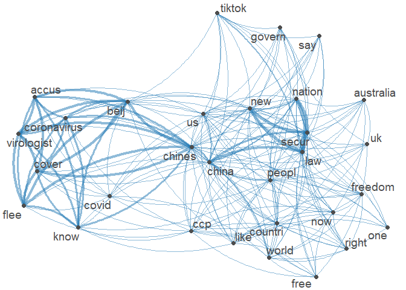
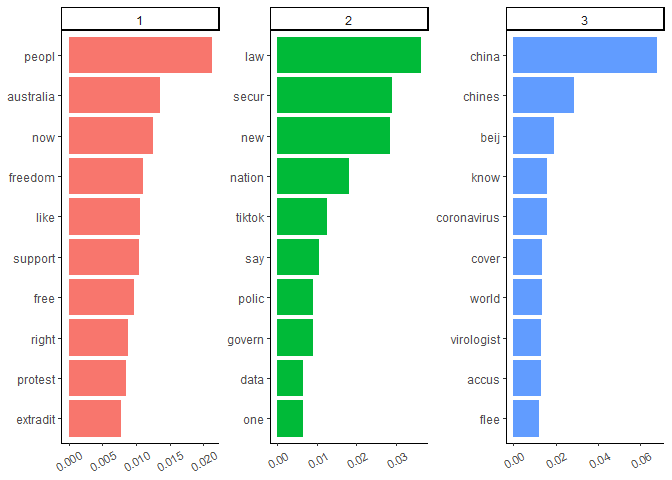
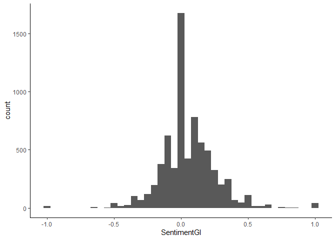
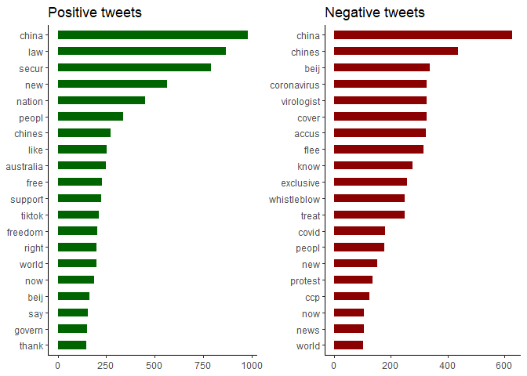

Twitter Data Analysis
================
Marta Fattorel

``` r
library(rtweet)
library(ggplot2)
library(wordcloud)
library(tm)
library(topicmodels)
library(lubridate)
library(SentimentAnalysis)
library(quanteda)
library(ggpubr)
library(dplyr)
library(tidytext)
```

# RETRIEVE TWITTER DATA

``` r
# consumer_key <- "xxx"
# consumer_secret <- "xxx"
# access_token <- "xxx"
# access_secret <- "xxx"
# 
# token <- create_token(
#   app = "xxx",
#   consumer_key = consumer_key,
#   consumer_secret = consumer_secret,
#   access_token = access_token,
#   access_secret = access_secret)
```

``` r
# # retrieve 100,000 tweets from July 5 to July 12
# HK_tweets <- search_tweets(q = "Hong Kong OR #hongkongers OR #HKPolice", n = 100000,
#                            lang = "en",
#                            include_rts = FALSE,
#                            since = "2020-07-05",
#                            until = "2020-07-12",
#                            retryonratelimit = TRUE)
# 
# HK_df <- data.frame(HK_tweets$text, HK_tweets$created_at)
# 
# # select a random subset of 7,000 tweets
# samp <- sample(nrow(HK_df), 7000)
# HK_df <- HK_df[samp,]
# 
# colnames(HK_df) <- c("Text", "Date")
# row.names(HK_df) <- NULL
# HK_df$Date <- as.Date(ymd_hms(HK_df$Date))  # remove time
# write.csv(HK_df, "HK_df.csv", quote = TRUE) # save the dataframe
```

# DATA PRE-PROCESSING - TEXT MINING

``` r
HK_df <- read.csv("HongKong.csv", row.names = 1, stringsAsFactors = TRUE)
```

``` r
# remove duplicates
HK_df  <- HK_df[unique(HK_df$Text),]
#row.names(HK_df) <- NULL

# remove mentions
HK_df$Text <- gsub("@[[:alpha:]]*","", HK_df$Text)

# remove emoji in unicode
HK_df$Text <- gsub("[<].*[>]", "", HK_df$Text)

# remove tabs
HK_df$Text = gsub("[ |\t]{2,}", " ", HK_df$Text)

# leading blanks
HK_df$Text = gsub("^ ", "", HK_df$Text)

# lagging blankc
HK_df$Text = gsub(" $", "", HK_df$Text)

# general spaces
HK_df$Text = gsub(" +", " ", HK_df$Text)

# convert to basic ASCII text
HK_df$Text <- iconv(HK_df$Text, to = "ASCII", sub = " ")
```

``` r
# build a corpus
text_corpus <- Corpus(VectorSource(HK_df$Text))

# convert to lower case
text_corpus <- tm_map(text_corpus, content_transformer(tolower))
```

    ## Warning in tm_map.SimpleCorpus(text_corpus, content_transformer(tolower)):
    ## transformation drops documents

``` r
# words to remove
text_corpus <- tm_map(text_corpus, removeWords, 
c("will", "just", "can", "amp", "via", "also", "yet", "per", "hong", "kong", "s", "t", "get", "hk", "because", "hongkongers", "hkpolice", "hongkong"))
```

    ## Warning in tm_map.SimpleCorpus(text_corpus, removeWords, c("will", "just", :
    ## transformation drops documents

``` r
# stem words
text_corpus <- tm_map(text_corpus, stemDocument)
```

    ## Warning in tm_map.SimpleCorpus(text_corpus, stemDocument): transformation drops
    ## documents

``` r
# remove stopwords
text_corpus <- tm_map(text_corpus, removeWords, 
                      stopwords("english"))
```

    ## Warning in tm_map.SimpleCorpus(text_corpus, removeWords, stopwords("english")):
    ## transformation drops documents

``` r
# remove punctuation
text_corpus <- tm_map(text_corpus, removePunctuation)
```

    ## Warning in tm_map.SimpleCorpus(text_corpus, removePunctuation): transformation
    ## drops documents

``` r
# remove URLs
removeURL <- function(x) gsub("http[^[:space:]]*", "", x)
text_corpus <- tm_map(text_corpus, content_transformer(removeURL))
```

    ## Warning in tm_map.SimpleCorpus(text_corpus, content_transformer(removeURL)):
    ## transformation drops documents

``` r
# remove extra whitespace
text_corpus <- tm_map(text_corpus, stripWhitespace)
```

    ## Warning in tm_map.SimpleCorpus(text_corpus, stripWhitespace): transformation
    ## drops documents

``` r
# remove numbers
text_corpus <- tm_map(text_corpus, removeNumbers)
```

    ## Warning in tm_map.SimpleCorpus(text_corpus, removeNumbers): transformation drops
    ## documents

``` r
# build a document term matrix
dtm <- TermDocumentMatrix(text_corpus) 
matrix <- as.matrix(dtm) 
words <- sort(rowSums(matrix),decreasing = TRUE) 
df <- data.frame(word = names(words),freq = words)
```

``` r
# plot the word cloud
set.seed(1234) # for reproducibility

wordcloud(words = df$word, freq = df$freq, min.freq = 1, max.words = 200, random.order = FALSE, rot.per = 0.35, colors = brewer.pal(12, "Paired"))
```

<!-- -->

``` r
# clean corpus back to the HK_df
text_df <- data.frame(text_clean = get("content", text_corpus), 
                      stringsAsFactors = FALSE)
HK_df$Text <- text_df$text_clean
```

``` r
# Generate Tokens
toks <- tokens(HK_df$Text)
```

``` r
# plot the network of words co-occurrences 
set.seed(30)

fcmat <- fcm(toks, context = "document", tri = FALSE)
feat <- names(topfeatures(fcmat, 30))
fcm_select(fcmat, pattern = feat) %>%
textplot_network(min_freq = 0.5)
```

<!-- -->

# TOPIC MODELLING

``` r
# select a random subset of 3,500 tweets
set.seed(100)
samp <- sample(nrow(HK_df), 3500)

corpus_sub <- Corpus(VectorSource(HK_df$Text[samp]))
dtm_sub = DocumentTermMatrix(corpus_sub)
doc.length = apply(dtm_sub, 1, sum) # find the sum of words in each document
dtm_sub = dtm_sub[doc.length > 0,]  # remove all docs without words
```

``` r
# Number of topics
k <- 3

# Run LDA using Gibbs sampling
ldaOut3 <-LDA(dtm_sub, k, method = "Gibbs", control = 
                list(nstart = 5, seed = list(2003, 5, 63, 100001, 765), best = TRUE, 
                     burnin = 4000, iter = 2000, thin = 500))
```

``` r
topics <- as.matrix(topics(ldaOut3))
terms <- as.matrix(terms(ldaOut3, 10))
topics_prob <- as.matrix(ldaOut3@gamma)
```

``` r
# top 10 words within each topic according to beta (i.e. per-topic-per-word probability)
topics_beta <- tidy(ldaOut3, matrix = "beta")

top_terms_b <- topics_beta %>%
  group_by(topic) %>%
  top_n(10, beta) %>%
  ungroup() %>%
  arrange(topic, -beta)

theme_set(theme_classic())
top_terms_b %>%
  mutate(term = reorder(term, beta)) %>%
  ggplot(aes(term, beta, fill = factor(topic))) +
  labs(x = NULL, y = NULL) +
  geom_col(show.legend = FALSE) +
  facet_wrap(~ topic, scales = "free") +
  theme(axis.text.x = element_text(angle = 30, vjust = 0.5, size = 8)) +
  coord_flip()
```

<!-- -->

# SENTIMENT ANALYSIS

``` r
HK_sentiment <- analyzeSentiment(HK_df$Text)

# keep only these columns
HK_sentiment <- dplyr::select(HK_sentiment, 
                              SentimentGI, 
                              WordCount)

# add to the dataset
HK_df <- cbind.data.frame(HK_df, HK_sentiment)
HK_df <- HK_df[!is.na(HK_df$SentimentGI),] # remove NA
```

``` r
# plot the distribution of SentimentGI
theme_set(theme_classic())

ggplot(HK_df[, 3:4], aes(SentimentGI)) +
  geom_histogram(binwidth = .05)
```

<!-- -->

``` r
# find the word-frequency in positive and negative tweets, without considering neutral ones
text_corpus_pos <- Corpus(VectorSource(HK_df[HK_df$SentimentGI > 0, "Text"]))
dtm.pos <- TermDocumentMatrix(text_corpus_pos) 
mat.pos <- as.matrix(dtm.pos) 
words.pos <- sort(rowSums(mat.pos), decreasing = TRUE)

text_corpus_neg <- Corpus(VectorSource(HK_df[HK_df$SentimentGI < 0, "Text"]))
dtm.neg <- TermDocumentMatrix(text_corpus_neg) 
mat.neg <- as.matrix(dtm.neg) 
words.neg <- sort(rowSums(mat.neg), decreasing = TRUE)

df_sent_pos <- data.frame(word = names(words.pos), freq = words.pos)
df_sent_neg <- data.frame(word = names(words.neg), freq = words.neg)
```

``` r
# plot the most frequent words
theme_set(theme_classic())

df_sent_pos$word <- factor(df_sent_pos$word, levels = df_sent_pos$word)
g1 <- ggplot(df_sent_pos[1:20,], aes(reorder(word, freq), y=freq)) +
  geom_bar(stat ='identity', width =.5, fill = "darkgreen") +
  labs(x = NULL, y = NULL, title = "Positive tweets") + coord_flip()

df_sent_neg$word <- factor(df_sent_neg$word, levels = df_sent_neg$word)
g2 <- ggplot(df_sent_neg[1:20,], aes(reorder(word, freq), y=freq)) +
  geom_bar(stat ='identity', width = .5, fill = "darkred") +
  labs(x = NULL, y = NULL, title = "Negative tweets") + coord_flip()

ggarrange(g1, g2, ncol = 2, nrow = 1)
```

<!-- -->
